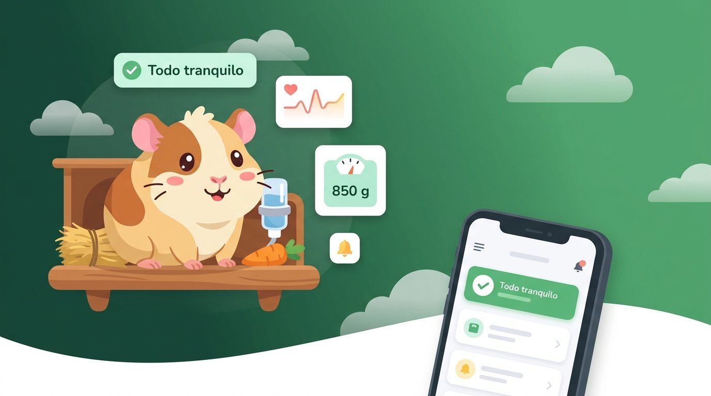

# Monitor de Cuyes — dashboard



Panel web del **Monitor de Salud de Cuyes**: estado de la jaula en vivo, alertas, registro de cada cuy (raza, pelaje, peso y notas) y la cuenta del usuario. Habla solo con el backend (`cuy-monitor-backend`); nunca con la base de datos.

React + TypeScript + Vite, React Query, CSS Modules con tokens de diseño. Más detalle en [`docs/ARCHITECTURE.md`](docs/ARCHITECTURE.md) y [`docs/DESIGN_SYSTEM.md`](docs/DESIGN_SYSTEM.md).

## Comandos

```bash
npm install
npm run dev          # http://localhost:5173, /api y /ws van al backend (VITE_DEV_BACKEND)
npm run test         # vitest
npm run typecheck    # tsc -b
npm run lint         # eslint
npm run build        # tsc -b && vite build
```

Sin backend, `VITE_USE_MOCKS=true npm run dev` sirve datos y un inicio de sesión falsos (cualquier usuario, código `123456`, botón de Google de demostración).

## Variables

Todas son públicas (acaban en el bundle del navegador): nunca pongas secretos. Ver `.env.example`.

| Variable | Para qué |
|---|---|
| `VITE_API_URL`, `VITE_WS_URL` | Vacías = mismo origen (Caddy en producción, proxy de Vite en desarrollo) |
| `VITE_CAGE_ID` | Código de la jaula piloto (`cage-1`) |
| `VITE_USE_MOCKS` | `true` = datos falsos desde `src/mocks/` |
| `VITE_GOOGLE_CLIENT_ID` | Client ID público de Google para "Continuar con Google"; vacío oculta el botón |

## Despliegue

La imagen del `Dockerfile` compila la SPA y la sirve con Caddy en el puerto 80, detrás del Caddy principal de la EC2 (ver `infra/` del backend).
